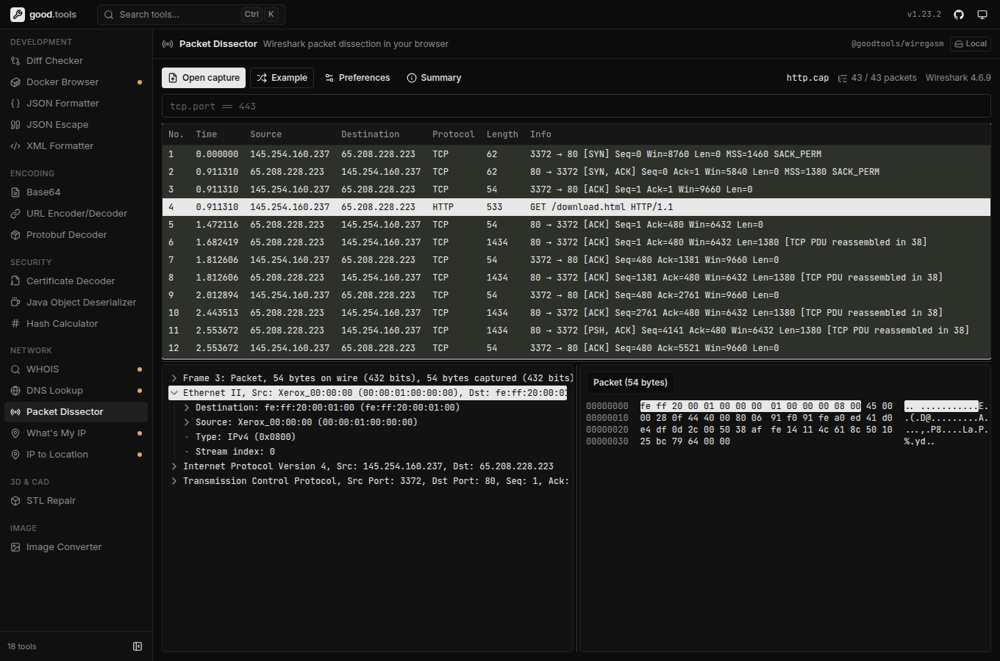

# good.tools

Free, fast, privacy-focused developer tools that run in your browser.

**Live:** [good.tools](https://good.tools)



- **Private.** Most tools run entirely client-side, some of them with WebAssembly (Wireshark, libvips, mesh repair). Tools that call a server are labelled **Online**.
- **Fast.** Each tool is code-split and loads only when you open it. Press <kbd>⌘K</kbd> / <kbd>Ctrl K</kbd> or <kbd>/</kbd> to jump to any tool.
- **Self-hostable.** One Docker image, configured at runtime.

| Category        | Tools                                                                         |
| --------------- | ----------------------------------------------------------------------------- |
| **Development** | Diff Checker, JSON Formatter, JSON Escape, XML Formatter, Docker Browser      |
| **Encoding**    | Base64, URL Encoder/Decoder, Protobuf Decoder                                 |
| **Security**    | Certificate Decoder, Java Object Deserializer, Hash Calculator                |
| **Network**     | Packet Dissector (Wireshark), DNS Lookup, WHOIS, What's My IP, IP to Location |
| **Image**       | Image Converter                                                               |
| **3D & CAD**    | STL Repair                                                                    |

## Development

```bash
bun install
bun run dev        # http://localhost:3000
bun run check      # type-check, Biome lint + format, tests
```

Stack: React 19, React Router, Vite, Tailwind CSS 4, TanStack Query, zustand, Biome, Vitest.

To add a tool, read [CONTRIBUTING.md](CONTRIBUTING.md). It covers the project layout, the tool registry, the UI guidelines and the PR process.

## Self-hosting

Every release is published to the GitHub Container Registry for `linux/amd64` and `linux/arm64`:

```bash
docker run -p 3000:80 ghcr.io/good-tools/good.tools:latest
```

In production, pin a release version tag (`ghcr.io/good-tools/good.tools:<version>`) rather than `latest`; see [Releases](https://github.com/good-tools/good.tools/releases). To build it yourself instead, run `docker build -t good-tools .`.

By default, self-hosted instances send no telemetry and hide online tools. To enable the online tools, run the backend services and point the image at them:

```bash
docker run -p 3000:80 \
  -e DISABLE_ONLINE_TOOLS=false \
  -e INTERNET_TOOLS_URL=https://your-api.example.com \
  -e IMAGE_BROWSER_URL=https://your-images-api.example.com \
  ghcr.io/good-tools/good.tools:latest
```

| Variable               | Default | Description                       |
| ---------------------- | ------- | --------------------------------- |
| `PORT`                 | `80`    | Nginx listen port                 |
| `ENABLE_TELEMETRY`     | `false` | Enable Google Analytics           |
| `GA_TRACKING_ID`       | `""`    | GA4 tracking ID                   |
| `DISABLE_ONLINE_TOOLS` | `true`  | Hide tools that need backend APIs |
| `INTERNET_TOOLS_URL`   | `""`    | DNS / WHOIS / IP API base URL     |
| `IMAGE_BROWSER_URL`    | `""`    | Docker image browser API base URL |

If you serve `dist/` from somewhere else, send `Cross-Origin-Opener-Policy: same-origin` and `Cross-Origin-Embedder-Policy: require-corp`. The image converter needs them for multi-threaded WebAssembly.

## Contributing

Contributions are welcome, whether a bug report, a new tool or a fix. Start with [CONTRIBUTING.md](CONTRIBUTING.md).

### Contributors

<a href="https://github.com/good-tools/good.tools/graphs/contributors">
  
</a>

## License

[MIT](LICENSE)
